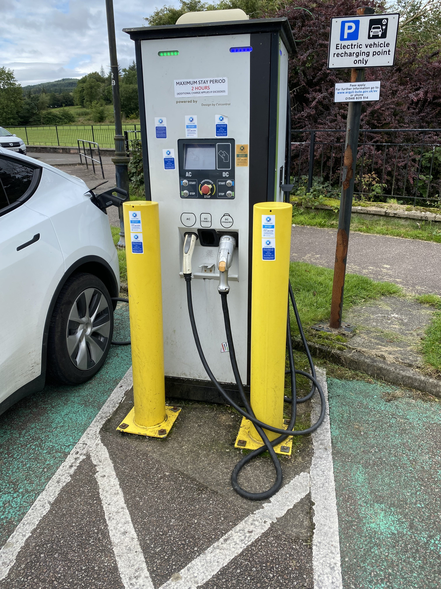
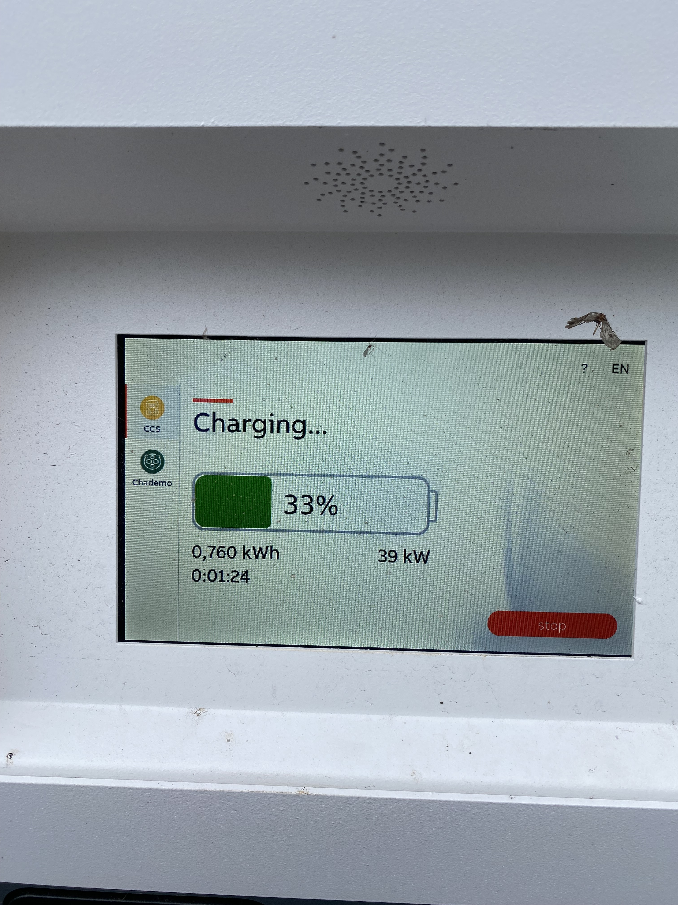
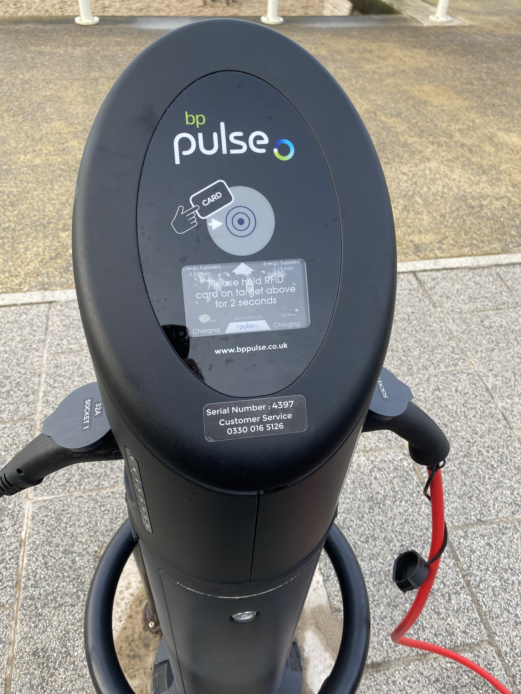
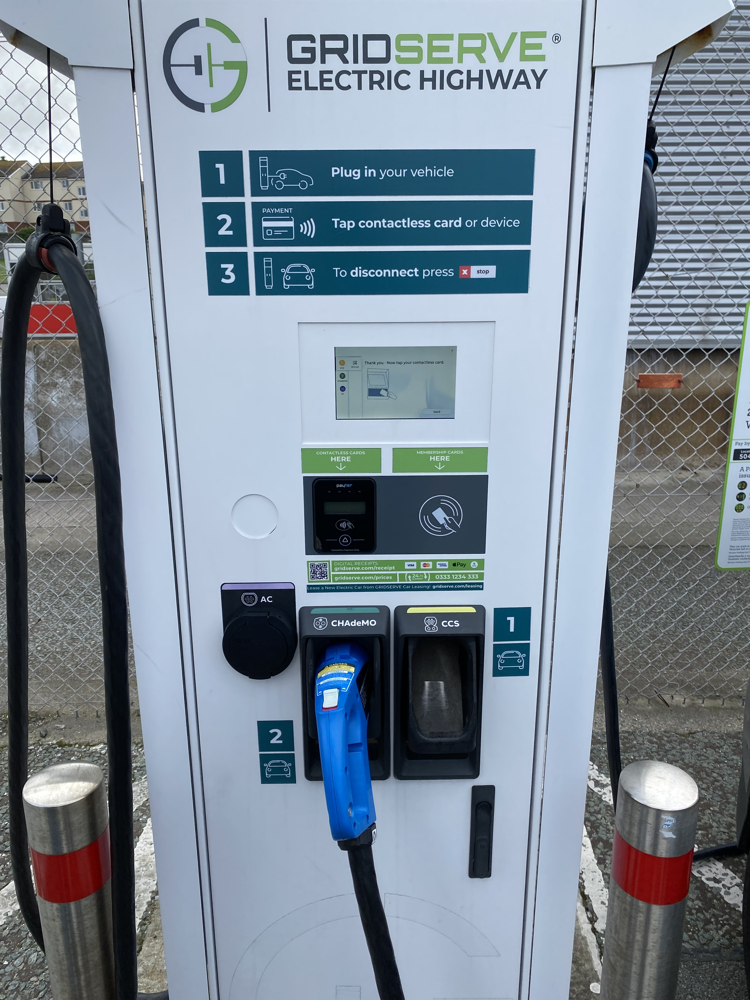
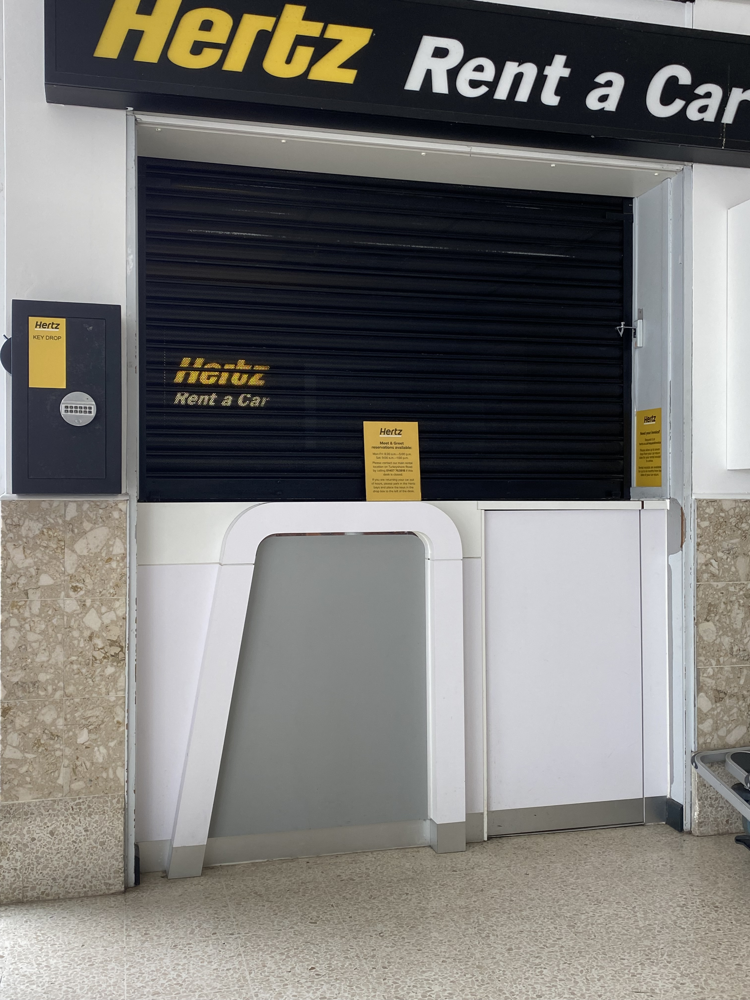

.What you need to get to web pay

The biro line around it signifies "this is the only thing you will need...". I think what the Hertz employee meant was you will be seing this a lot.

.What you see when web pay doesn't work

.Whoohoo a working charger... it must work someone is plugged in. Right? Wrong.

.And you see it a lot...

If you see that don't try again and just ring the service desk and explain to them that you need a working charger with working web pay. They are friendly but they can't do much else for you than to point you towards a working charger. I've found them very understanding. Nearly as if they have this a lot.

.Have seen this a lot too...

Just to add. When you see the above you will not be standing under a filling station roof. You will be standing in the cold, rain, sun, wind, dark, or whatever condition Scottland can provide and you may well be standing there for a long time fiddling with credit cards, phones, and charging cables. And don't forget to read the warnings about charging cables and heavy rain. Or phones and heavy rain. It's the reason I put the QR code in the pay and display clip to keep it dry. You may have company and if you do they will probably not have compliments to hand out about EV charging technology or EV cars in Scottland. Say something nice about Scottland, maybe mention the Edinburgh Tattoo or say that the highland games you visited (somewhat later than planned) were realy nice. There's no point wallowing in pain. And the one other thing you might not like when you open that lid is to see that the charging infrastructure has a cousin called signal strength. whatever you do don't have an empty phone. You might want a zip lock for the phone if it's not watertight. 

[CAUTION]
====
Do NOT run out of mobile data when in the highlands (signal strength aside).
You WILL use a lot of mobile data and you WILL make many calls.
====

.Ringing Hertz and going around in loops

.Ringing Hertz again (and again and...)

.Let's go to Tobermory to get to a working charger

.Dead

This one was an example of looking for a charger and finding it blocked so go to the next one on the map. It's not the one at Tobermory which I took no pictures of out of shear disgust at standing 20m next to a distillery I wanted to go to but couldn't as it would trap me on Mull or leave me stuck in the highlands had I not taken the next ferry back.

.380 Mile range... or not

.Woohoo it's charging..... ahhh 39. Plan more time again.

.39 instead of 50... but it's working

.BPpulse

.Use the App...

.App not available for tourists

.BPpulse map view... no way to activate

.Had to have this one rebooted to get it to work

.Let's add insult to injury. You can pay for parking while you wait for the charger to reboot
image::./images/IMG_7703.jpg[]

Just to add.. No the charger was not cheap but then neither was the parking. 

.Hertz closed but sign up to ring if closed...

.Let's call since the sign says to...

.Ring ring ring ring ring.....beeep beep beep

But at least you can hear it ringing behind the counter as you stand there.

.Others trying their luck at returning a car at Holyhead

.Returning it full

.Overfill it as it will loose charge and you WILL be billed.

We returned it with 89% and Hertz logged it with 87%. We guessed this would be the case so made sure not to fall into that trap at least.

.Glad to see this end of the car

Nice car if there is a charging infrastructure at nice places but there isn't a charging infrastructure in the Highlands and the ones that worked are not at nice places. So plan to spend lot's of time driving by nice places to get to not nice places and to spend plenty of time there.